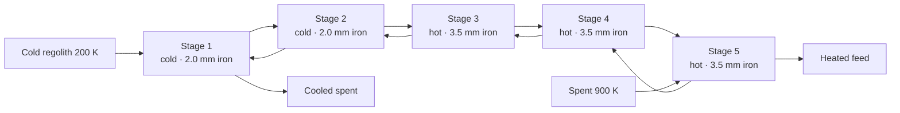

# RCFX — Regolith Counter-Flow Heat Exchange

<p align="center">
  
</p>

<p align="center">
  <strong>Five-stage counter-current fluidized bed for recovering sensible heat from lunar regolith.</strong><br/>
  Custom GPU DEM + lumped thermal model. Modeling only — no hardware prototype.
</p>

RCFX is a low-pressure (claim envelope 0.1–0.5 bar) heat-recovery system: cold incoming regolith and hot spent regolith pass each other through five fluidized stages. Dual-role **iron shot** is both thermal mass and a mechanical agitator for cohesive lunar fines (Geldart C). An electrodynamic dust shield (EDS) and pre-classification of the finest cut are the other two levers.

This repository holds the custom single-GPU DEM, the 5-stage lumped thermal model, DEM checkpoints, and the utility-patent support package.

Standalone DEM engine: [luckyseoul/custom-gpu-dem](https://github.com/luckyseoul/custom-gpu-dem).

---

## Validated figures and limits

**The cited DEM results were validated locally.** The figure audit independently
reproduced the checkpoint heights and EMI ratios: **3.58×**, **8.04×**, and
**8.53×**. Their local validation is recorded in the
[primary high-N audit](patent_evidence/2026-06-04/Rung1_HighN_Primary_Audit_6500.md).
The thermal-model finding below does not invalidate those DEM results.

**The thermal-performance claims are withdrawn pending a corrected counter-flow model.**
The shipped recurrence reproduces 75.6%, 11.8 kW, and 221 W at 0.14 bar, but
advances both streams in the same direction. It reverses the labelled heat flow
at stages 2 and 4 and gives 230.3% at 0.20 bar. These are reproducible arithmetic
outputs, not validated plant performance. The 1.88% parasitic claim consequently
has no validated recovered-heat denominator.

| Quantity | Verified value | Interpretation |
|----------|---------------:|----------------|
| Reference pressure input | 0.14 bar | Model input, not a demonstrated operating point |
| Real-drag checkpoint height ratio | 3.58× | Regolith mean z divided by a separate no-iron step-400 reference |
| High-N checkpoint height ratio (N = 6500) | 8.04× at step 1000; sampled maximum 8.53× at step 1300 | Saved-step ratios, not seconds or a demonstrated steady-state gain |
| No-iron reference mean z | 3.2307 mm | `rung1_highn_no_iron_step000400.npz` |
| Real-drag mean z, regolith / iron | 11.5609 / 34.4689 mm | `physical_drag_real_u3.5_iron1.5mm_step002000.npz` |
| DEM archive | 1467 files, 151.0 MB | Includes 13 root-level dumps; decimal MB |
| Design inlet temperatures | 200 K and 900 K | Specification inputs; 140 K/stage is not a solved temperature profile |

EMI here is the **locally validated ratio of mean regolith particle-centre heights**.
The real-drag run and no-iron reference have different gas/force configurations;
the reference also ends before the cited with-iron steps. These ratios do not
isolate the causal effect of iron. The cited files have all particle centres
inside x,y ∈ [0, 0.018] m and z ∈ [0, 0.060] m; this does not establish
whole-sphere containment. These geometric and comparison limits do not negate
the local validation of the reported DEM numbers.

See **[the figure audit](docs/FIGURE_AUDIT.md)** for corrections, limitations,
and replay commands. There is no hardware prototype.

---

## How the plant is arranged



<p align="center">
  
  <br/><em>FIG. 1 — Rev 5.2 flow arrangement: opposing regolith streams and a parallel gas loop. The lower panel shows gas connections to the same five stages.</em>
</p>

**Historical Option A parameter inputs (performance unvalidated)**

| | Cold stages 1–2 | Hot stages 3–5 |
|--|--|--|
| Iron diameter | 2.0 mm (good-var DEM also run at 1.5 mm) | 3.5 mm |
| Iron fill | 0.32 | 0.20 |
| Model gas velocity | 0.066 m/s | 0.0525 m/s |
| EDS | 0.97 | 0.97 |
| Pre-class cutoff | 22 µm | 22 µm |

The velocity multipliers 4.4 and 3.5 multiply a fixed 0.015 m/s reference in
code, not its calculated *U*<sub>mf</sub>. At the recurrence's invariant 550 K
average, calculated *U*<sub>mf</sub> is 0.005676 m/s; the actual ratios are
11.63 and 9.25.

---

## Lumped 5-stage model

`models/five_stage_counterflow.py` contains a Wen–Yu calculation and empirical
iron/EDS modifiers, but its energy recurrence does not solve opposite-end
counter-flow boundary conditions. The following charts are **diagnostics of
that legacy calculation**. Values above 100% are shown without clipping.

<p align="center">
  
</p>

<p align="center">
  
</p>

The stage coefficients are 86.34% for the first two steps and 99.48% for the
last three at 0.14 bar. Their use in the recurrence produces alternating heat
transfer; they do not establish which physical stages limit a plant. The
sensitivity curves below are regenerated directly from the same code and
inherit its invalidity:

<p align="center">
  
</p>

```bash
python3 models/five_stage_counterflow.py
```

---

## Custom GPU DEM

Particle-scale results come from the in-repo CuPy DEM (`sims/custom_gpu_dem/`):

- Hertz + JKR-style contacts and rolling
- Stokes + quadratic drag with local porosity
- Physical walls, floor, and a hard lid / freeboard cap
- Device-side cell list for high-N runs

Rung 1 (coarse fraction + iron shot) is the high-N physical-lid series and the good-variable real-drag point cited above. Both were generated with this DEM.

<p align="center">
  
  <br/><em>Real-drag checkpoint: 1.5 mm iron, 3.5 m/s gas, step 2000. Iron mean z is 34.47 mm; maximum particle-centre z is 40.13 mm. This maximum is not a measured lid height. Marker sizes are illustrative.</em>
</p>

<p align="center">
  
</p>

The no-iron reference has mean regolith z ≈3.2 mm and mean speed ≈0.4 m/s.
The cited high-N with-iron samples have mean regolith z ≈26–28 mm, not a
measured bed-surface height. Their mean regolith speeds are ≈37–41 m/s
(maximum ≈130 m/s). The real-drag checkpoint is shown in a separate panel
because it uses different forcing. Kinematic clipping and damping constrain
particle centres. The DEM numbers were validated locally and reproduced by
this audit; this figure review did not rerun the GPU dynamics.

<p align="center">
  
</p>

Archive catalog and load snippet: **[DATA.md](DATA.md)**.
Plotted values, model/checkpoint SHA-256 hashes, and inventory file sizes: **[figure_data.json](docs/figures/figure_data.json)**.
Independent checkpoint measurements: **[dem_validation.json](docs/figures/dem_validation.json)**.

### Load the primary checkpoint

```python
import numpy as np
d = np.load(
    "sims/custom_gpu_dem/rung1_highn_checkpoints/"
    "physical_drag_real_u3.5_iron1.5mm_step002000.npz"
)
print(sorted(d.files))          # pos, vel, radius, mat, step
reg = d["pos"][d["mat"] == 0]
print("regolith <z> mm", reg[:, 2].mean() * 1e3)
```

Regenerate the figures in this README:

```bash
python3 scripts/generate_readme_figures.py
python3 patent_drawings/generate_fig01_system_overview.py
python3 scripts/audit_dem_figures.py
python3 -m unittest discover -s tests -v
```

---

## Repository map

```
models/                 5-stage lumped model and parameter sweeps
analysis/               sweep outputs and operating-point notes
sims/custom_gpu_dem/    DEM kernels, runners, and checkpoints
rung_results/           campaign tables
docs/                   parameters, campaign plan, figures, spec PDFs
patent_application/     2026-06-05 utility support bundle
patent_evidence/        exhibits and audits
patent_drawings/        FIG. 1–7 (SVG + PDF)
scripts/                figure and logo generators
```

| Also useful | |
|-------------|--|
| [DATA.md](DATA.md) | Checkpoint catalog |
| [docs/rcfx_key_parameters.md](docs/rcfx_key_parameters.md) | Rev 5.2 numbers |
| [docs/RCFX_Rung_Campaign_Plan.md](docs/RCFX_Rung_Campaign_Plan.md) | Rung 0–5 plan |
| [rung_results/RUNG_CAMPAIGN_RESULTS.md](rung_results/RUNG_CAMPAIGN_RESULTS.md) | Campaign log |
| [patent_application/2026-06-05/](patent_application/2026-06-05/) | Filing-oriented bundle |
| [docs/RCFX_Complete_Specification_Rev52.pdf](docs/RCFX_Complete_Specification_Rev52.pdf) | RCFX Rev 5.2 |

---

## Scope

There is no hardware prototype, bench test, or simulant campaign. Thermal
performance remains unvalidated because the current recurrence is invalid for
counter-flow. The cited DEM heights and EMI ratios retain their local validation;
their metric definitions and comparison conditions are stated above. Rung 5
metre-scale lofting traces do not support quantitative EMI. Dated support
bundles contain the earlier DEM validation records alongside historical thermal
claims; use the figure audit for the corrections to figures and thermal status.

---

## License

Code and campaign data: [MIT](LICENSE). Patent drawings and specification text are published here as technical disclosure for enablement; they do not grant patent rights.
