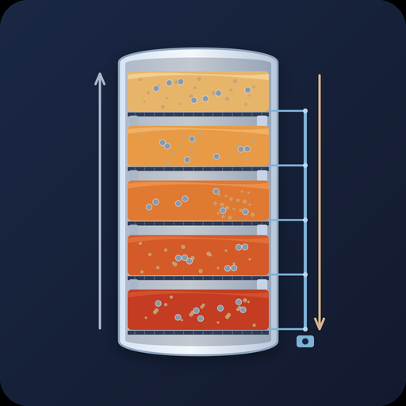
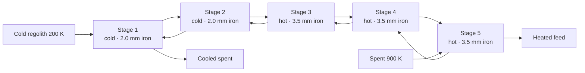
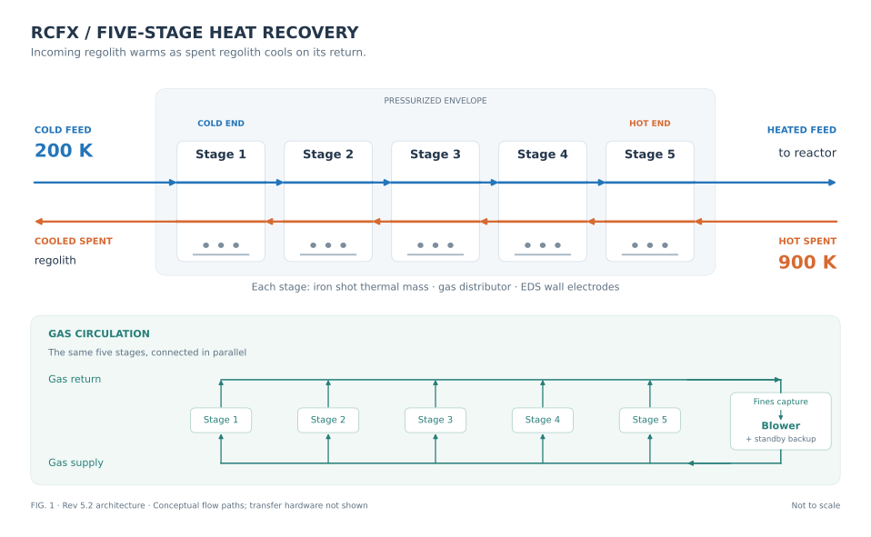
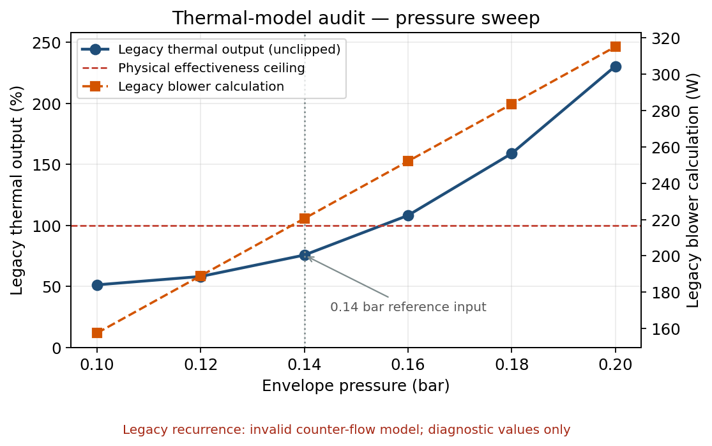
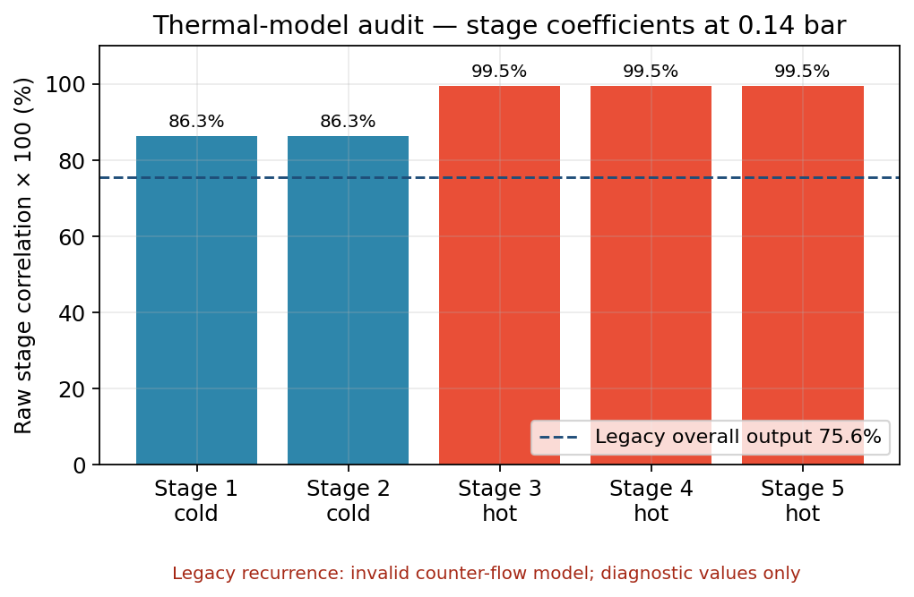
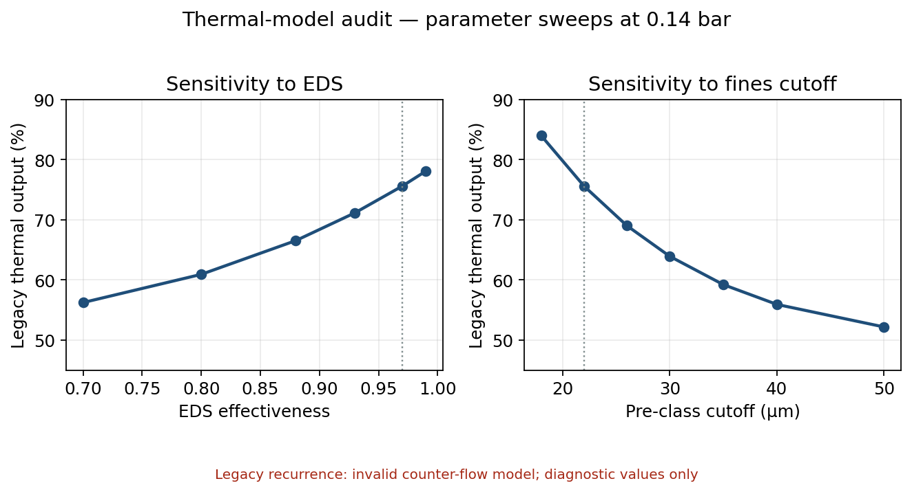
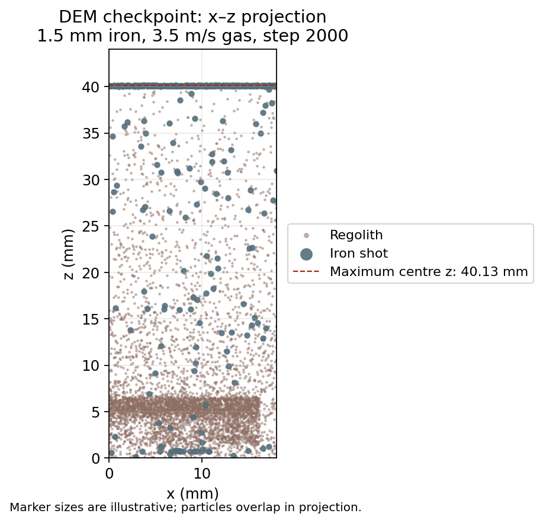
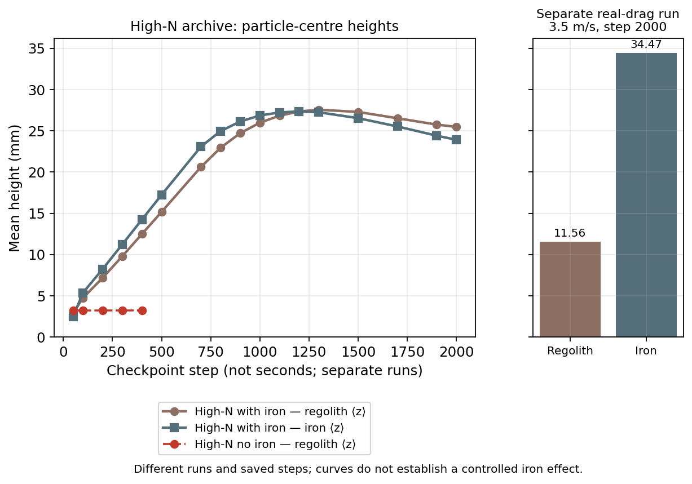
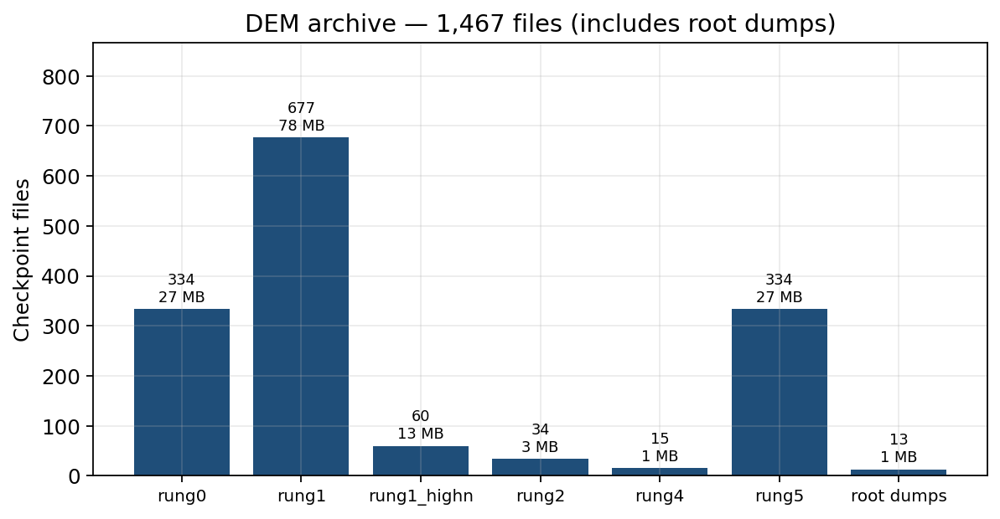

# RCFX — Regolith Counter-Flow Heat Exchange

<p align="center">
  
</p>

<p align="center">
  <strong>Five-stage counter-current fluidized bed for recovering sensible heat from lunar regolith.</strong><br/>
  Custom GPU DEM + lumped thermal model. Modeling only — no hardware prototype.
</p>

RCFX is a low-pressure (claim envelope 0.1–0.5 bar) heat-recovery system: cold incoming regolith and hot spent regolith pass each other through five fluidized stages. Dual-role **iron shot** is both thermal mass and a mechanical agitator for cohesive lunar fines (Geldart C). An electrodynamic dust shield (EDS) and pre-classification of the finest cut are the other two levers.

This repository holds the custom single-GPU DEM, the 5-stage lumped thermal model, DEM checkpoints, and the utility-patent support package.

Standalone DEM engine: [luckyseoul/custom-gpu-dem](https://github.com/luckyseoul/custom-gpu-dem).

---

## Headline numbers

All DEM citations below are from **contained** checkpoints (100% of particles inside **x,y ∈ [0, 0.018] m**, z ≥ 0, physical lid). EMI is with-iron regolith ⟨z⟩ / no-iron-control regolith ⟨z⟩. The lumped-model blower number is the post-fix value (`vol_flow = U × AREA`). Pre-fix **68 W** and unbounded EMI **107.9× / 109.4×** are historical only.

| Quantity | Value | Source |
|----------|------:|--------|
| Working envelope pressure | **0.14 bar** | `models/five_stage_counterflow.py` |
| Overall thermal effectiveness | **75.6%** | same, 5-stage counter-flow |
| Recovered heat @ 100 kg/h | **11.8 kW** | same |
| Blower power / parasitic | **221 W / 1.88%** | same (`vol_flow = U × AREA`) |
| Good-var EMI (1.5 mm iron, 3.5 m/s) | **3.58×** | `physical_drag_real_u3.5_iron1.5mm_step002000.npz` |
| High-N EMI (N = 6500) | **8.04× @ 1000s**, peak **8.53× @ 1300s** | `rung1_highn_checkpoints/` |
| Temperature span | 200 → 900 K, ~140 K / stage | spec Rev 5.2 |

> These are **model and DEM results**, not measured hardware. There is no prototype.

---

## How the plant is arranged



<p align="center">
  
  <br/><em>FIG. 1 — five-stage counter-current bed, parallel blower manifold, iron shot, EDS.</em>
</p>

**Locked operating point (Option A, inside Rev 5.2 claims)**

| | Cold stages 1–2 | Hot stages 3–5 |
|--|--|--|
| Iron diameter | 2.0 mm (good-var DEM also run at 1.5 mm) | 3.5 mm |
| Iron fill | 0.32 | 0.20 |
| Velocity | 4.4 × *U*<sub>mf</sub> (DEM *U*<sub>G</sub> = 0.066 m/s) | 3.5 × *U*<sub>mf</sub> |
| EDS | 0.97 | 0.97 |
| Pre-class cutoff | 22 µm | 22 µm |

---

## Lumped 5-stage model

The plant-level numbers come from `models/five_stage_counterflow.py`: Wen–Yu *U*<sub>mf</sub>, iron-agitation and EDS modifiers on cohesion/entrainment, and a true counter-flow energy balance.

<p align="center">
  
</p>

<p align="center">
  
</p>

Cold stages limit the plant. Hot stages are already near the remaining ΔT. Effectiveness is a strong function of EDS and of how aggressively the cohesive fines are cut:

<p align="center">
  
</p>

```bash
python3 models/five_stage_counterflow.py
```

---

## Custom GPU DEM

Particle-scale results come from the in-repo CuPy DEM (`sims/custom_gpu_dem/`):

- Hertz + JKR-style contacts and rolling
- Stokes + quadratic drag with local porosity
- Physical walls, floor, and a hard lid / freeboard cap
- Device-side cell list for high-N runs

Rung 1 (coarse fraction + iron shot) is the high-N physical-lid series and the good-variable real-drag point cited above. Both were generated with this DEM.

<p align="center">
  
  <br/><em>Good-variable checkpoint: 1.5 mm iron, real drag, 3.5 m/s, step 2000. Iron (large) mixed through the bed; lid at ~41 mm.</em>
</p>

<p align="center">
  
</p>

No-iron control stays packed (~3.2 mm, ~0.4 m/s). With iron the bed expands to ~25–28 mm (high-N) under the lid. Mean regolith speed at the 8.04× / 8.53× checkpoints is ~37–41 m/s (vmax ~130 m/s): lid-capped agitation, not a calm expanded bed. That ⟨z⟩ ratio vs the no-iron control is the Effective Mobilization Index (EMI).

<p align="center">
  
</p>

Full file list, hashes-by-folder, and load snippet: **[DATA.md](DATA.md)**.

### Load the primary checkpoint

```python
import numpy as np
d = np.load(
    "sims/custom_gpu_dem/rung1_highn_checkpoints/"
    "physical_drag_real_u3.5_iron1.5mm_step002000.npz"
)
print(sorted(d.files))          # pos, vel, radius, mat, step
reg = d["pos"][d["mat"] == 0]
print("regolith <z> mm", reg[:, 2].mean() * 1e3)
```

Regenerate the figures in this README:

```bash
python3 scripts/generate_readme_figures.py
```

---

## Repository map

```
models/                 5-stage lumped model and parameter sweeps
analysis/               sweep outputs and operating-point notes
sims/custom_gpu_dem/    DEM kernels, runners, and checkpoints
rung_results/           campaign tables
docs/                   parameters, campaign plan, figures, spec PDFs
patent_application/     2026-06-05 utility support bundle
patent_evidence/        exhibits and audits
patent_drawings/        FIG. 1–7 (SVG + PDF)
scripts/                figure and logo generators
```

| Also useful | |
|-------------|--|
| [DATA.md](DATA.md) | Checkpoint catalog |
| [docs/rcfx_key_parameters.md](docs/rcfx_key_parameters.md) | Rev 5.2 numbers |
| [docs/RCFX_Rung_Campaign_Plan.md](docs/RCFX_Rung_Campaign_Plan.md) | Rung 0–5 plan |
| [rung_results/RUNG_CAMPAIGN_RESULTS.md](rung_results/RUNG_CAMPAIGN_RESULTS.md) | Campaign log |
| [patent_application/2026-06-05/](patent_application/2026-06-05/) | Filing-oriented bundle |
| [docs/RCFX_Complete_Specification_Rev52.pdf](docs/RCFX_Complete_Specification_Rev52.pdf) | PERRY-RCFX-004 Rev 5.2 |

---

## Scope

Results are from the lumped model and the custom GPU DEM. There is no hardware prototype, bench test, or simulant campaign. Quantitative DEM citations use physical-lid checkpoints only (100% of particles inside **x,y ∈ [0, 0.018] m**, z ≥ 0). Rung 5 metre-scale beds are not quantitative EMI.

---

## License

Code and campaign data: [MIT](LICENSE). Patent drawings and specification text are published here as technical disclosure for enablement; they do not grant patent rights.
